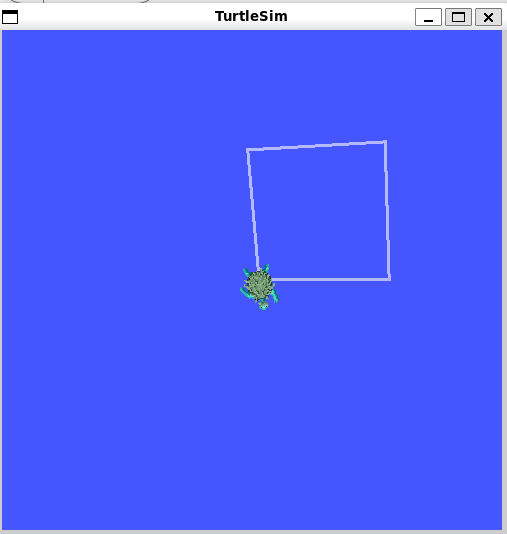

# ROS 2 TurtleSim Square

## Description

A simple ROS 2 project using Python and TurtleSim to control a turtle and draw a square.

## Result

The turtle successfully draws a square:

## How It Works

The turtle moves forward for a fixed distance, then rotates 90 degrees. This process is repeated to create a square.

## Technologies

- ROS 2
- Python
- TurtleSim
- rclpy

## Project File

- `TurtleSquare.py` — Contains the Python code used to control the turtle and draw the square.

## Purpose

This project was created as a ROS 2 task to practice controlling TurtleSim using Python.
